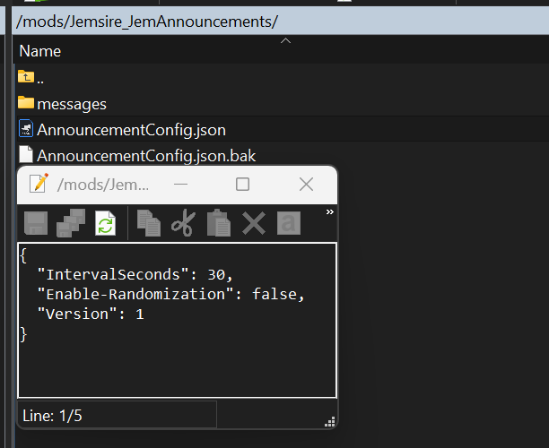
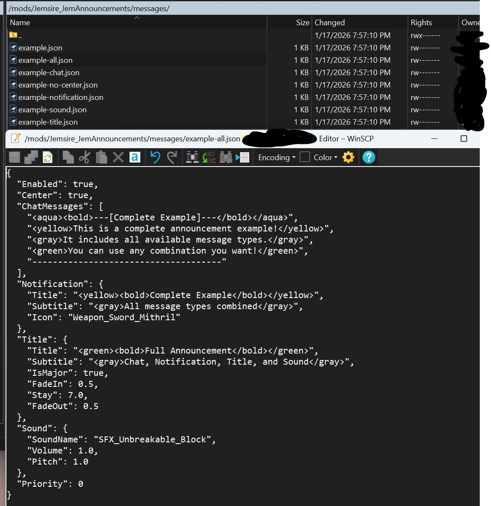
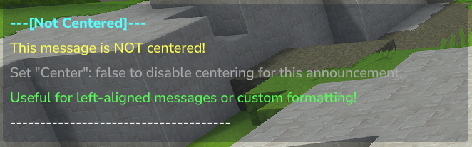
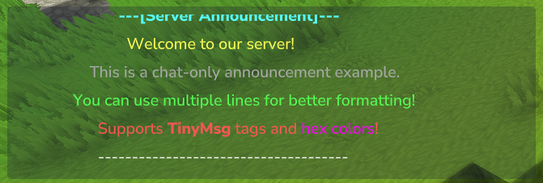
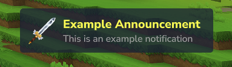

# JemAnnouncements


A Hytale server plugin that provides an automated announcement system with support for chat, notifications, titles, and sound messages. This plugin allows you to schedule and customize announcements that are automatically sent to all online players at configurable intervals.

## Current Features

- **Multiple Message Types**: Support for chat messages, action bar notifications, titles, and sound effects
- **Flexible Scheduling**: Configurable intervals for automatic announcements
- **Message Ordering**: Choose between sequential or random message ordering
- **Priority System**: Set message priorities to control display order
- **Message Centering**: Automatically center chat messages for better presentation
- **Multiple Message Files**: Create unlimited announcement messages as separate JSON files
- **Rich Formatting**: Support for hex, rgb, legacy color(`&` codes), and TinyMsg tags
- **Hot Reload**: Reload configuration and messages without restarting the server using `/announce-reload`
- **Manual Triggering**: Manually trigger any announcement by name using `/announce <message-name>`
- **Update Check**: Check GitHub releases for updates and notifies you if there is one
- **Example Templates**: Automatically generates example message templates on first launch

## Message Types

- **Chat Messages**: Send formatted chat messages to all players (supports multiple lines, centering, and rich formatting)
- **Notification**: Display notifications similar to item pickup notifications with custom icons
- **Title Messages**: Show title and subtitle messages with customizable fade in/out timing and major title support
- **Sound Effects**: Play custom sounds to all players with configurable volume and pitch

## Installation

1. Download the latest release from the [releases page](https://github.com/jemsire/JemAnnouncements/releases)
2. Place the `JemAnnouncements-x.x.x.jar` file into your Hytale server's `mods` folder
3. Start your server to generate the configuration files
4. Edit the `Jemsire_JemAnnouncements/AnnouncementConfig.json` file to configure intervals and ordering
5. (Optional) Customize message files in `Jemsire_JemAnnouncements/messages/` folder
6. In-game type `/announce-reload` to hot reload the config and start the plugin

**Note:** Example message templates are automatically created on first launch. You can customize them or create your own message files.

## Configuration

After first launch, configuration files will be created in your mods folder. The plugin uses a two-tier configuration system:

1. **AnnouncementConfig.json**: Main configuration with timing and ordering settings
2. **messages/**: Individual message configuration files

### Main Configuration File (AnnouncementConfig.json)

The main configuration file is located at `Jemsire_JemAnnouncements/AnnouncementConfig.json`:

```json
{
  "IntervalSeconds": 300,
  "Enable-Randomization": false,
  "Version": 1
}
```

**Configuration Options:**

- `IntervalSeconds`: Time in seconds between announcements (default: 300 = 5 minutes)
- `Enable-Randomization`: Set to `true` for random message order, `false` for sequential order (default: false)
- `Version`: Configuration version (currently 1)

### Message Configuration Files

Each announcement message has its own configuration file in `Jemsire_JemAnnouncements/messages/`. Example templates are automatically created on first launch:

- `example.json` - Complete example with all message types
- `example-chat.json` - Chat messages only
- `example-notification.json` - Action bar notification only
- `example-title.json` - Title message only
- `example-sound.json` - Sound effect only
- `example-all.json` - All message types combined
- `example-no-center.json` - Example without message centering

#### Message Configuration Structure

```json
{
  "Enabled": true,
  "Center": true,
  "Priority": 0,
  "ChatMessages": [
    "<aqua><bold>---[Announcement]---</bold></aqua>",
    "<yellow>This is an announcement message!</yellow>"
  ],
  "Notification": {
    "Title": "<yellow><bold>Announcement</bold></yellow>",
    "Subtitle": "<gray>This is a notification</gray>",
    "Icon": "Weapon_Sword_Mithril"
  },
  "Title": {
    "Title": "<green><bold>Announcement</bold></green>",
    "Subtitle": "<gray>This is a title</gray>",
    "IsMajor": false,
    "FadeIn": 0.25,
    "Stay": 5.0,
    "FadeOut": 0.25
  },
  "Sound": {
    "SoundName": "SFX_Unbreakable_Block",
    "Volume": 1.0,
    "Pitch": 1.0
  }
}
```

**Configuration Options:**

- `Enabled`: Enable or disable this message (true/false)
- `Center`: Center chat messages in the chat window (true/false, default: true)
- `Priority`: Higher priority messages are shown first when sorted (default: 0)
- `ChatMessages`: Array of chat message strings (sent in order)
- `Notification`: notification configuration (optional)
- `Title`: Title/subtitle configuration (optional)
- `Sound`: Sound effect configuration (optional)

#### Message Format Examples

**Chat Messages Only:**

```json
{
  "Enabled": true,
  "Center": true,
  "ChatMessages": [
    "<aqua><bold>---[Server Rules]---</bold></aqua>",
    "<yellow>1. Be respectful to other players</yellow>",
    "<yellow>2. No griefing or cheating</yellow>",
    "<yellow>3. Have fun!</yellow>"
  ]
}
```

**Notification:**

```json
{
  "Enabled": true,
  "Notification": {
    "Title": "<yellow><bold>Server Event Starting!</bold></yellow>",
    "Subtitle": "<gray>Join us in 5 minutes</gray>",
    "Icon": "Weapon_Sword_Mithril"
  }
}
```

**Title Message:**

```json
{
  "Enabled": true,
  "Title": {
    "Title": "<green><bold>Welcome to the Server!</bold></green>",
    "Subtitle": "<gray>Enjoy your stay</gray>",
    "IsMajor": true,
    "FadeIn": 0.5,
    "Stay": 7.0,
    "FadeOut": 0.5
  }
}
```

**Sound Effect:**

```json
{
  "Enabled": true,
  "Sound": {
    "SoundName": "SFX_Unbreakable_Block",
    "Volume": 1.0,
    "Pitch": 1.0
  }
}
```

**Combined (All Types):**

```json
{
  "Enabled": true,
  "Center": true,
  "ChatMessages": [
    "<aqua><bold>---[Complete Example]---</bold></aqua>",
    "<yellow>This includes all message types!</yellow>"
  ],
  "Notification": {
    "Title": "<yellow><bold>Complete Example</bold></yellow>",
    "Subtitle": "<gray>All message types combined</gray>",
    "Icon": "Weapon_Sword_Mithril"
  },
  "Title": {
    "Title": "<green><bold>Full Announcement</bold></green>",
    "Subtitle": "<gray>Chat, Notification, Title, and Sound</gray>",
    "IsMajor": true,
    "FadeIn": 0.5,
    "Stay": 7.0,
    "FadeOut": 0.5
  },
  "Sound": {
    "SoundName": "SFX_Unbreakable_Block",
    "Volume": 1.0,
    "Pitch": 1.0
  },
  "Priority": 0
}
```

#### Formatting Support

The plugin supports both TinyMsg tags and legacy color codes:

**TinyMsg Tags(like html):**
- `<red>`, `<blue>`, `<green>`, etc. - Color tags
- `<bold>`, `<italic>`, `<underline>`, `<strikethrough>` - Formatting tags
- `<color:#FF0000>` - Custom hex colors
- `<reset>` - Reset formatting

**Legacy Color Codes:**
- `&0` through `&f` - Color codes
- `&l` (bold), `&o` (italic), `&n` (underline), `&m` (strikethrough)
- `&r` - Reset formatting

**Note:** Legacy color codes are automatically converted to TinyMsg format. Both formats can be used together in the same message.

## Screenshots

### Main Configuration File


### Message Configuration File


### Chat Message Example


### Centered Chat Message Example


### Notification Example


### Title Example


## Commands

- `/announce-reload` - Reloads the plugin configuration and messages without restarting the server
  - **Permission**: `jemsire.announcements.reload`
  - **Usage**: Reloads main config and all message files, restarts scheduler if interval or ordering changed

- `/announce <message-name>` - Manually trigger an announcement by message name
  - **Permission**: `jemsire.announcements.announce`
  - **Usage**: `/announce example` (message name without .json extension)
  - **Example**: `/announce example` triggers the message from `example.json`

## How It Works

### Architecture

The plugin follows a modular architecture:

- **Main Plugin Class** (`AnnouncementPlugin.java`): Handles plugin initialization, configuration management, message discovery, and command registration
- **Message Loader** (`MessageLoader.java`): Dynamically discovers and loads message files from the messages directory
- **Announcement Scheduler** (`AnnouncementScheduler.java`): Manages scheduled announcements with configurable intervals and ordering
- **Message Sender** (`MessageSender.java`): Handles sending different message types (chat, notification, title, sound) to all players
- **Configuration System**: Manages main config and individual message configs with hot reload support

### Announcement Flow

1. **Plugin Startup**: Plugin discovers all `.json` files in the `messages/` directory
2. **Message Loading**: Each message file is loaded and validated
3. **Scheduler Start**: Scheduler starts with configured interval and ordering mode
4. **Message Selection**: Based on configuration, selects next message (sequential or random)
5. **Message Sending**: Sends all enabled message types (chat, notification, title, sound) to all online players
6. **Repeat**: Process repeats at configured intervals

### Message Types

1. **Chat Messages** (`MessageSender.sendChatMessages()`):
   - Supports multiple lines sent in sequence
   - Automatic centering support (configurable per message)
   - Full TinyMsg and legacy color code support
   - Strips formatting tags for accurate centering calculations

2. **Notifications** (`MessageSender.sendNotification()`):
   - Similar to item pickup notifications
   - Supports title, subtitle, and optional icon
   - Icon can be any valid Hytale item name (e.g., "Weapon_Sword_Mithril")

3. **Title Messages** (`MessageSender.sendTitle()`):
   - Full title and subtitle support
   - Major title option (adds gold border)
   - Customizable fade in, stay, and fade out timing
   - Uses EventTitleUtil for display

4. **Sound Effects** (`MessageSender.playSound()`):
   - Plays 3D positioned sounds to all players
   - Configurable volume and pitch
   - Uses SoundEvent asset system

### Message Ordering

- **Sequential Mode** (`Enable-Randomization: false`): Messages are sent in the order they appear in the messages directory, cycling through all enabled messages
- **Random Mode** (`Enable-Randomization: true`): Messages are selected randomly from all enabled messages

### Priority System

Messages are sorted by priority (higher priority first) when loaded. This affects the order in sequential mode. Priority does not affect random mode selection.

## Building from Source

### Prerequisites

- Java Development Kit (JDK) 25 or higher
- Gradle 8.0 or higher

### Build Steps

1. Clone the repository:
   ```bash
   git clone https://github.com/jemsire/JemAnnouncements.git
   cd JemAnnouncements
   ```

2. Ensure `HytaleServer.jar` is in the `libs/` directory

3. Build the project:
   ```bash
   ./gradlew build
   ```

4. The compiled JAR will be in `build/libs/JemAnnouncements-x.x.x.jar`

## Project Structure

```
JemAnnouncements/
├── src/main/java/com/jemsire/
│   ├── commands/
│   │   ├── AnnounceCommand.java          # Command handler for /announce
│   │   └── ReloadCommand.java             # Command handler for /announce-reload
│   ├── config/
│   │   ├── AnnouncementConfig.java        # Main configuration data class
│   │   └── AnnouncementMessage.java       # Message configuration data class
│   ├── plugin/
│   │   └── AnnouncementPlugin.java        # Main plugin class
│   └── utils/
│       ├── AnnouncementScheduler.java     # Schedules and manages announcements
│       ├── MessageLoader.java             # Loads message files from directory
│       ├── MessageSender.java              # Sends messages to players
│       ├── PlaceholderReplacer.java        # Placeholder replacement utility
│       ├── ColorUtils.java                 # Color code conversion utilities
│       ├── TinyMsg.java                    # TinyMsg parsing utility
│       ├── UpdateChecker.java              # Checks for updates
│       └── Logger.java                     # Logging utility
├── src/main/resources/
│   ├── manifest.json                       # Plugin metadata
│   └── messages/                           # Example message templates
│       ├── example.json
│       ├── example-chat.json
│       ├── example-notification.json
│       ├── example-title.json
│       ├── example-sound.json
│       ├── example-all.json
│       └── example-no-center.json
├── build.gradle.kts                        # Gradle build configuration
└── settings.gradle.kts                     # Gradle project settings
```

## Technical Details

### Dependencies

- **HytaleServer.jar**: Provided at compile time, required at runtime
- **Java Standard Library**: Uses standard Java libraries for file I/O, threading, and collections

### Security

- Configuration files are stored in the plugin's data directory
- Permission-based command access (`jemsire.announcements.reload`, `jemsire.announcements.announce`)
- Message content is validated during loading

### Performance

- **Asynchronous Scheduling**: Announcement scheduler runs in a background thread to prevent blocking the game server
- **Non-Blocking**: Message sending operations don't block the main game thread
- **Efficient Loading**: Messages are loaded once at startup and cached
- **Update Checking**: Update checks run asynchronously during startup to avoid delays

### Error Handling

- Validates message files before loading
- Skips disabled messages and invalid configurations
- Logs errors to server console without crashing the server
- Gracefully handles missing or corrupted message files
- Continues operation even if individual message types fail to send

## Troubleshooting

### Announcements Not Appearing

1. **Check Message Files**: Ensure message files exist in `Jemsire_JemAnnouncements/messages/` directory
2. **Verify Enabled Status**: Check that `"Enabled": true` in your message JSON files
3. **Check Interval**: Verify `IntervalSeconds` in `AnnouncementConfig.json` is set appropriately
4. **Check Server Logs**: Look for error messages in the server console
5. **Reload Config**: Use `/announce-reload` after updating the configuration
6. **Validate JSON**: Ensure your message JSON files are valid (use a JSON validator)
7. **Check Players Online**: Announcements only send when players are online

### Permission Errors

- Ensure you have the `jemsire.announcements.reload` permission to use the reload command
- Ensure you have the `jemsire.announcements.announce` permission to use the announce command
- Check your server's permission system configuration

### Messages Not Loading

- Verify message files are in the `messages/` directory (not the root config directory)
- Check that message files have `.json` extension
- Ensure JSON syntax is valid (no trailing commas, proper quotes, etc.)
- Check server logs for specific error messages about file loading

### Formatting Not Working

- Verify TinyMsg tags are properly closed (e.g., `<bold>text</bold>`)
- Check that legacy color codes use `&` symbol (not `§`)
- Ensure color codes and tags are properly nested
- Some formatting may not work in title messages (they use plain text)

### Sound Not Playing

- Verify the sound name is correct (check Hytale's sound asset names)
- Ensure volume and pitch values are valid (0.0 to 1.0 for volume, typically 0.5 to 2.0 for pitch)
- Check server logs for sound-related errors
- Some sounds may require specific conditions to play

### Scheduler Not Starting

- Check that at least one message file is enabled
- Verify `IntervalSeconds` is set to a positive number
- Check server logs for scheduler initialization errors
- Try using `/announce-reload` to restart the scheduler

## Contributing

Contributions are welcome! Please feel free to submit a Pull Request.

## License

This project is licensed under the MIT License - see the LICENSE file for details.

## Author

**TinyTank800**

- Website: [https://jemsire.com/JemAnnouncements](https://jemsire.com/JemAnnouncements)

## Support

For issues, feature requests, or questions, please open an [Issue](https://github.com/jemsire/JemAnnouncements/issues).
